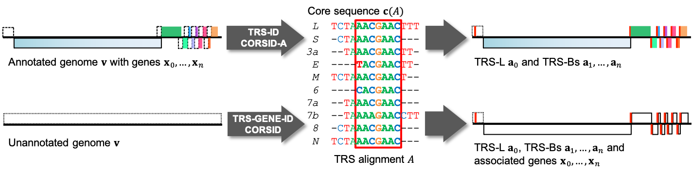
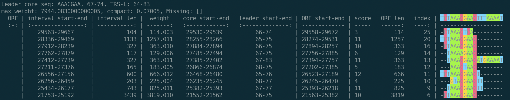
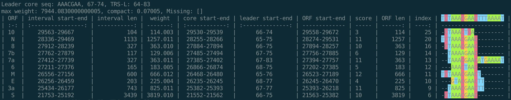

# CORSID

[](http://bioconda.github.io/recipes/corsid/README.html)
[](https://badge.fury.io/py/corsid)

CORSID is a computational tool to simultaneously identify TRS sites, the core sequence and gene locations given an unannotated coronavirus genome sequence.
We also provide another tool, CORSID-A, which identifies TRS sites and the core sequence given a coronavirus genome sequence with annotated gene locations.

The data and results can be found in the repo [CORSID-data](https://github.com/elkebir-group/CORSID-data). The visualized results of our tool applied to 468 coronavirus genomes can be found in [CORSID-viz](https://elkebir-group.github.io/CORSID-viz/).



## Contents

  1. [Pre-requisites](#pre-requisites)
  2. [Installation](#install)
      * [Using pip](#pip)
      * [Using conda](#conda)
  3. [Usage instructions](#usage)
      * [I/O formates](#io)
      * [Example](#example)

<a name="pre-requisites"></a>

## Pre-requisites
+ python3 (>=3.7)
+ [numpy](https://numpy.org/doc/)
+ [pysam](https://pysam.readthedocs.io/en/latest/)
+ [pandas](https://pandas.pydata.org/pandas-docs/stable/index.html)
+ [pytablewriter](https://pytablewriter.readthedocs.io/en/latest/)
+ [tqdm](https://tqdm.github.io/)
+ (optional for simulation pipeline) [snakemake (>=5.2.0)](https://snakemake.readthedocs.io)

If you install with conda or pip as described bellow, then you don't need to manually install these pakcages.

<a name="install"></a>

## Installation

<a name="pip"></a>

### Using pip

1. Create a new conda environment named "corsid" and install dependencies:

   ```bash
   conda create -n corsid python=3.7
   ```

2. Then activate the created environment: `conda activate corsid`.
3. Use `pip` to install the package:
    ```bash
    pip install corsid
    ```

<a name="conda"></a>

### Using conda

1. Create a new conda environment named "corsid" and install dependencies:

   ```bash
   conda create -n corsid python=3.7
   ```

2. Then activate the created environment: `conda activate corsid`.
3. Install the package into current environment "corsid":

    ```bash
    conda install -c bioconda corsid
    ```

<a name="usage"></a>

## Usage instructions

<a name="io"></a>

### I/O formats

CORSID takes a **FASTA file** containing the complete genome as input. Optionally it also takes an **annotation file (GFF format)** to validate the identified genes.

CORSID-A takes a **FASTA file and an annotation file (GFF format)** as input. It will find candidate regions for each gene given the annotation file, and run CORSID-A on candidate regions.

The output is an JSON file containing sorted solutions and auxilary information. This file can be used as the input to the [visualization webapp](https://elkebir-group.github.io/CORSID-viz/#/Viz).
The program also outputs to the standard output, where it shows tables of solutions and visualization of TRS alignment.

<a name="example"></a>

### Example

After installation, you can check if the program runs correctly by analyzing the SARS-CoV-2 genome (NC_045512) as follows:
```bash
git clone git@github.com:elkebir-group/CORSID.git
cd CORSID
corsid -f test/NC_045512.fasta -o test/NC_045512.json > test/NC_045512.txt
```
You can find a list of solutions displayed as tables in `test/NC_045512.txt`. The best solution should be the same as the figure below:


You can also use option `-g test/NC_045512.gff` to validate the identified genes.
```bash
corsid -f test/NC_045512.fasta -g test/NC_045512.gff \
    -o test/NC_045512.json > test/NC_045512.txt
```
The result will look like:


Similarly, you can also run CORSID-A with command:
```bash
corsid_a -f test/NC_045512.fasta -g test/NC_045512.gff \
    -o test/NC_045512.corsid_a.json > test/NC_045512.corsid_a.txt
```
Note that the annotation GFF file is required for CORSID-A.
