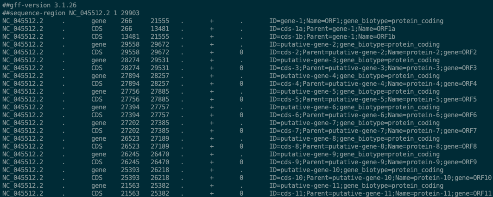

# CORSID

[](http://bioconda.github.io/recipes/corsid/README.html)
[](https://badge.fury.io/py/corsid)

CORSID is a computational tool to simultaneously identify TRS sites, the core sequence and gene locations given an unannotated coronavirus genome sequence.
We also provide another tool, CORSID-A, which identifies TRS sites and the core sequence given a coronavirus genome sequence with annotated gene locations.

The data and results can be found in the repo [CORSID-data](https://github.com/elkebir-group/CORSID-data). The visualized results of our tool applied to 468 coronavirus genomes can be found in [CORSID-viz](https://elkebir-group.github.io/CORSID-viz/) [(source repo)](https://github.com/elkebir-group/CORSID-viz). Docker containers can be found in [CORSID-container](https://github.com/elkebir-group/CORSID-container) and [Docker hub](https://hub.docker.com/r/chuanyiz/corsid).

If you use CORSID in you work, please cite the following paper ([bioRxiv](https://doi.org/10.1101/2021.11.10.468129)):

Zhang, Chuanyi, Palash Sashittal, and Mohammed El-Kebir. "CORSID enables de novo identification of transcription regulatory sequences and genes in coronaviruses." _bioRxiv_ (2021).


## Contents

  1. [Pre-requisites](#pre-requisites)
  2. [Installation](#install)
      * [Using pip](#pip)
      * [Using conda](#conda)
  3. [Usage instructions](#usage)
      * [I/O formates](#io)
      * [Example](#example)

<a name="pre-requisites"></a>

## Pre-requisites
+ python3 (>=3.7)
+ [numpy](https://numpy.org/doc/)
+ [pysam](https://pysam.readthedocs.io/en/latest/)
+ [pandas](https://pandas.pydata.org/pandas-docs/stable/index.html)
+ [pytablewriter](https://pytablewriter.readthedocs.io/en/latest/)
+ [tqdm](https://tqdm.github.io/)
+ (optional for simulation pipeline) [snakemake (>=5.2.0)](https://snakemake.readthedocs.io)

If you install with conda or pip as described bellow, then you don't need to manually install these pakcages.

<a name="install"></a>

## Installation

<a name="conda"></a>

### Using conda

1. Create a new conda environment named "corsid" and install dependencies:

   ```bash
   conda create -n corsid python=3.7
   ```

2. Then activate the created environment: `conda activate corsid`.
3. Install the package into current environment "corsid":

    ```bash
    conda install -c bioconda corsid
    ```

<a name="pip"></a>

### Using pip

1. Create a new conda environment named "corsid" and install dependencies:

   ```bash
   conda create -n corsid python=3.7
   ```

2. Then activate the created environment: `conda activate corsid`.
3. Use `pip` to install the package:
    ```bash
    pip install corsid
    ```

<a name="usage"></a>

## Usage instructions

<a name="io"></a>

### I/O formats

#### Input files

- **CORSID**: CORSID identifies TRS-L, TRS-Bs, and genes directly in the complete genome.
  - **FASTA file**: the complete input genome
  - _**GFF3 annotation (optional)**_: annotation file to validate the identified genes
- **CORSID-A**: CORSID-A finds candidate regions for each gene given in the annotation file and identifies TRS-L and TRS-Bs in candidate regions.
  - **FASTA file**: the complete input genome
  - **GFF3 annotation**: known genes

#### Output files

- **CORSID**:
  - **JSON `{filename}.json`**: sorted solutions and auxilary information. This file can be used as the input to the [visualization webapp](https://elkebir-group.github.io/CORSID-viz/#/Viz). Solutions are **sorted in lexicographical order of (genome coverage, total matching score, minimum score)**, where "genome coverage" is the count of bases covered by identified genes, "total matching score" is the sum of matching scores between TRS-L and all identified TRS-Bs in the solution, and "minimum score" is the smallest matching score in the solution.
  - **GFF3 `{filename}.gff`**: annotated genes in GFF3 format of the optimal solution (the first one in the JSON output). Note that it shares the same file name as the JSON output, and the only difference is the extension.
  - CORSID also outputs to the **standard output**. It shows tables of solutions and visualization of TRS alignment. Users can redirect the standard output to a file as shown below.
- **CORSID-A**:
  - **JSON `{filename}.json`**: sorted solutions and auxilary information. Solutions are **sorted by their total matching score**, which is the sum of matching scores of TRS-B and all identified TRS-Bs in the solution.
  - **Standard output**: similar to output of CORSID.

<a name="example"></a>

### Example

After installation, you can check if the program runs correctly by analyzing the SARS-CoV-2 genome (NC_045512) as follows:
```bash
git clone git@github.com:elkebir-group/CORSID.git
cd CORSID
corsid -f test/NC_045512.fasta -o test/NC_045512.corsid.json > test/NC_045512.corsid.txt
```
The output files will be `test/NC_045512.corsid.json`, `test/NC_045512.corsid.gff`, and `test/NC_045512.corsid.txt`.

You can find a list of solutions displayed as tables in `test/NC_045512.corsid.txt`. The best solution should be the same as the figure below:


The corresponding GFF3 output should look like this:


You can also use option `-g test/NC_045512.gff` to validate the identified genes.
```bash
corsid -f test/NC_045512.fasta -g test/NC_045512.gff \
    -o test/NC_045512.corsid.json > test/NC_045512.corsid.txt
```
The result will look like:


Similarly, you can also run CORSID-A with command:
```bash
corsid_a -f test/NC_045512.fasta -g test/NC_045512.gff \
    -o test/NC_045512.corsid_a.json > test/NC_045512.corsid_a.txt
```
Note that the annotation GFF file is required for CORSID-A. The output files will be `test/NC_045512.corsid_a.json`, and `test/NC_045512.corsid_a.txt`.
